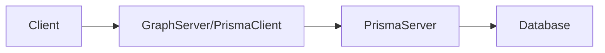

# Prisma GraphQL

Node based GraphQL server demo built on Prisma GraphQL Yoga and Prisma Cloud Database.

## Prisma

Prisma is a Cloud based Database that can be used to execute complicated resolver. It provides a database abstration to your Graph Server.

Primsa Client will connect your Graph Server to Prisma Cloud Database.



### Installation

#### Create Prisma directory

```bash
mkdir prisma
touch prisma/prisma.yml
touch prisma/datamodel.prisma
```

#### Define and map your schema to Prisma server in `datamodel.prisma`

```graphql
type Product {
  id: ID! @id
  title: String!
  sku: String!
  description: String!
  price: Int!
  inStock: Boolean!
  createdAt: DateTime! @createdAt
  updatedAt: DateTime! @updatedAt
}
```

Note: `@id` is a directive to allow Prisma to use its own unique identifier. `@createdAt` and `@updatedAt` are directives to timestamp your entry.

#### Create `prisma.yml`

```yml
# The HTTP endpoint for your Prisma API
endpoint: ''

# Points to the file that contains your datamodel
datamodel: datamodel.prisma

# Specifies language & location for the generated Prisma client
generate:
  - generator: javascript-client
    output: ../src/generated/prisma-client
```

Note: Prisma Client CLI will fill this in.

#### Create [Prisma Workspace](`https://https://app.prisma.io/`) Online

1. Create new workspace and follow instructions to authenticate.
2. Create demo server `prisma init hello-world` and select `Demo server + MySQL database`
3. Follow instructions to generate Prisma Client.
4. Run `prisma deploy`

#### Create Prisma Client

Prisma client will connect your Graph Server to Prisma Servers.  The following will automatically generate a Prisma client based on `prisma.yml`.

1. run `generate prisma` to create Prisma Client

A new folder called `.src/genertated/prisma-client/index.js` will be created.

#### Subscription

Subscriptions is a websocket that allows the client to subscribe to any mutations as defined in the subscription resolvers

```graphql
subscription {
  newProduct {
    id
    title
    sku
    description
    price
    inStock
  }
}
```
